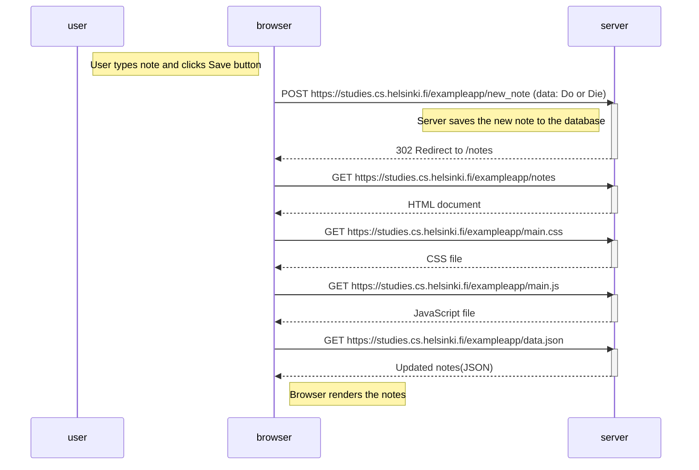

```mermaid
sequenceDiagram
    participant user
    participant browser
    participant server

    Note right of user: User types note and clicks Save button

    browser->>server: POST https://studies.cs.helsinki.fi/exampleapp/new_note (data: Do or Die)
    
    activate server
    Note left of server: Server saves the new note to the database
    server-->>browser: 302 Redirect to /notes
    deactivate server

    browser->>server: GET https://studies.cs.helsinki.fi/exampleapp/notes
    activate server
    server-->>browser: HTML document
    deactivate server

    browser->>server: GET https://studies.cs.helsinki.fi/exampleapp/main.css
    activate server
    server-->>browser: CSS file
    deactivate server

    browser->>server: GET https://studies.cs.helsinki.fi/exampleapp/main.js
    activate server
    server-->>browser: JavaScript file
    deactivate server

    browser->>server: GET https://studies.cs.helsinki.fi/exampleapp/data.json
    activate server
    server-->>browser: Updated notes(JSON)
    deactivate server

    Note right of browser: Browser renders the notes
```
