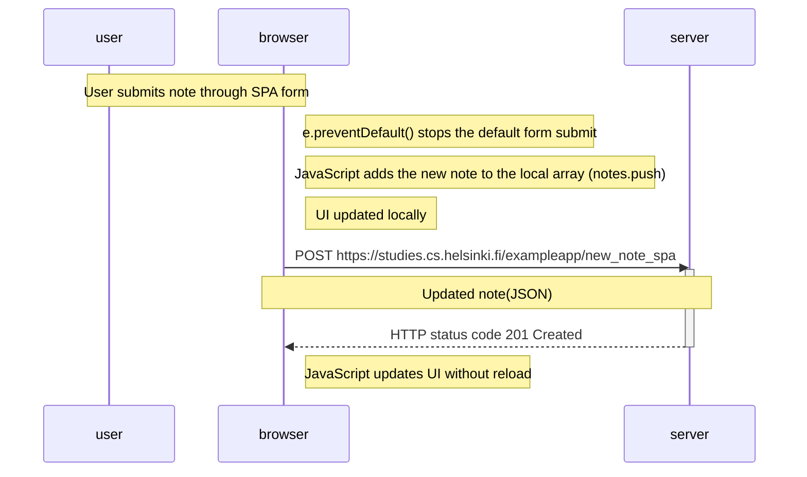

```mermaid
sequenceDiagram
    participant user
    participant browser
    participant server

    Note over user, browser: User submits note through SPA form

    Note right of browser: e.preventDefault() stops the default form submit
    Note right of browser: JavaScript adds the new note to the local array (notes.push)
    Note right of browser: UI updated locally 
    browser->>server: POST https://studies.cs.helsinki.fi/exampleapp/new_note_spa
    activate server
    Note over browser, server: Updated note(JSON)
    
    server-->>browser: HTTP status code 201 Created
    deactivate server

    Note right of browser: JavaScript updates UI without reload
```